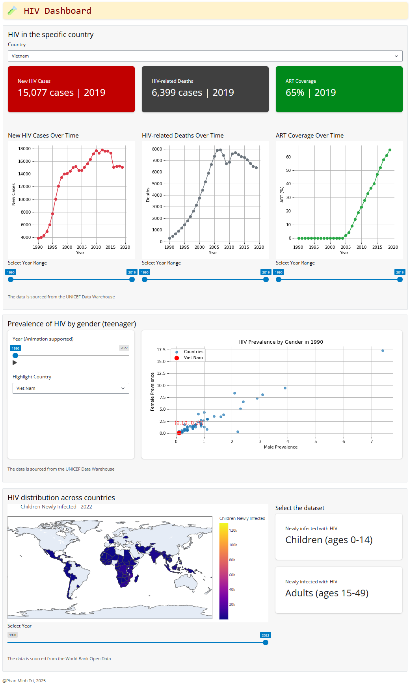

# HIV Dashboard | Data-driven story project
---
## Introduction
This project focuses on visualizing the changing prevalence of HIV globally and nationally over time using a dynamic, interactive dashboard built with Python Shiny. Drawing from multiple datasets including new HIV cases, deaths by age, ART (antiretroviral therapy) coverage, and global incidence trends, the dashboard aims to provide a comprehensive view of the epidemic’s evolution. 

The main question addressed is: **How has the prevalence and impact of HIV changed across countries and age groups over time?** This question is crucial because understanding historical and recent trends in HIV transmission and treatment informs global health strategies, public awareness, and policy-making. The data reveals not only how infection and death rates have shifted but also how effective interventions like ART have been across different regions. 

Visualizing this data, however, presents several challenges. The datasets vary in format, granularity, and coverage—some are global, others are country- or age-specific, and many contain missing values or inconsistent timelines. Additionally, different metrics operate on vastly different scales, making it difficult to convey insights in a unified visual format. 

To overcome this, the dashboard incorporates at least five charts of three distinct types—line plots, bar charts, area charts, and pie charts—each designed to communicate a specific aspect of the epidemic. Interactive features such as country selectors, year sliders, and dynamic chart filtering will allow users to explore patterns and compare trends effectively. The layout is designed to guide users through a structured narrative—starting with overall trends, diving into demographic details, and ending with a global snapshot.

The dashboard will strike a balance between technical accuracy and visual clarity, making complex epidemiological data more digestible and actionable for researchers, policymakers, and the general public.

## Wireframe
The dashboard will be organized into three main sections to provide a structured and intuitive user experience. The **first section** focuses on a national overview of the HIV epidemic. Users can select a specific country from a dropdown menu, and the dashboard will display **line charts** showing the trends over time for key indicators: new HIV infections, HIV-related deaths, and ART (antiretroviral therapy) coverage. These visualizations aim to highlight how each of these variables has changed across the selected country’s timeline, helping users understand the progression and response to the epidemic within a national context. Interactive features such as tooltips and time range filters will enhance the user's ability to explore and interpret the data.

The **second section** zooms in on the demographic impact of HIV, specifically focusing on new infections among teenagers by gender. This is presented through **a scatter plot** where each point represents a country in a given year, and the selected country is highlighted to enable easy comparison. The goal of this section is to reveal patterns in gender disparities among youth infection rates, a demographic particularly important for long-term development and public health planning. A year slider allows users to view how the distribution changes over time, offering a dynamic way to assess whether progress is being made in protecting younger populations.

The **final section** provides a global perspective, showcasing the distribution of HIV-related data across all countries on **a map**. Users can choose which factors they want to view, including new infections (ages 0 - 49), ART coverage and ART coverage for PMTCT (Prevention of Mother-to-Child Transmission). A timeline slider enables users to animate these metrics over the years, helping them observe changes and trends at a global scale. 

In conclusion, these three sections create a comprehensive, interactive dashboard that allows users to analyze the HIV epidemic from multiple perspectives—national, demographic, and global—while using intuitive controls to explore the data in meaningful ways.

## Deployment
> The dashboard may take a while to load.

